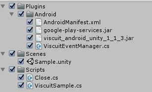
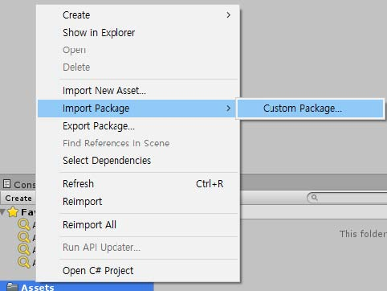

#VISCUIT Unity SDK 적용가이드

목차
=================
* [VISCUIT SDK 구성](#viscuit-sdk-구성)
* [SDK 적용하기](#sdk-적용하기)
	* [1. AdroidManifest.xml 설정](#1-adroidmanifest.xml-설정)
		* [1.1 퍼미션 추가](#11-퍼미션-추가)
		* [1.2 Google Play Service meta-data 추가](#12-google-play-service-meta-data-추가)
		* [1.3 viscuit Activity 추가](#13-viscuit-activity-추가)
    * [2. VISCUIT 사용하기](#2-viscuit-사용하기)
    	* [2.1 라이브러리 IMPORT](#21-라이브러리-import)
    	* [2.2 추가한 package Name 주의사항](#22-추가한-package-name-주의사항)
    	* [2.3 VISCUIT 초기화](#23-viscuit-초기화)
    	* [2.4 콜백을 받기 위한 리스너 등록](#24-콜백을-받기-위한-리스너-등록)
    	* [2.5 광고 호출](#25-콜백을-받기-위한-리스너-등록-및-광고-호출)
    	* [2.6 광고 존재 여부 확인](#26-광고-존재-여부-확인)
    	* [2.7 라이프 사이클 등록](#27-라이프-사이클-등록)
    	* [2.8 Proguard](#28-proguard)


---

## VISCUIT SDK 구성
- viscuit_android_unity_1_1_3.unitypackage
	- Plugins/Android/AndroidManafest.xml (내용만 참고)
	- Plugins/Android/google-play-services.jar (권장)
	- Plugins/Android/viscuit_android_unity_{version}.jar (필수)
	- Plugins/Android/ViscuitEventManager.cs (필수)
	- Scenes/Sample.unity (샘플)
	- Script/ViscuitSample.cs (샘플)




- 연동가이드


## SDK 적용하기

###  1. AdroidManifest.xml 설정
####  1.1 퍼미션 추가
```ruby
    <uses-permission android:name="android.permission.INTERNET" />
    <uses-permission android:name="android.permission.ACCESS_NETWORK_STATE" />
    <uses-permission android:name="android.permission.WRITE_EXTERNAL_STORAGE" />
```
Viscuit을 Android 6.0 이상에서 사용하실 경우에는
android.permission.WRITE_EXTERNAL_STORAGE 권한을 획득하셔야 합니다.

##### 1.2 Google Play Service meta-data 추가
```ruby
    <meta-data
        android:name="com.google.android.gms.version"
        android:value="@integer/google_play_services_version"/>
```
##### 1.3 viscuit Activity 추가
```xml
    <activity
        android:name="com.viscuit.sdk.ViscuitActivity"
        android:clearTaskOnLaunch="false"
        android:configChanges="keyboardHidden|orientation|screenSize"
        android:launchMode="singleTask"
        android:theme="@android:style/Theme.Light.NoTitleBar.Fullscreen"
        android:windowSoftInputMode="stateHidden" >
    </activity>
```

### 2. VISCUIT 사용하기


#### 2.1 라이브러리 IMPORT
> 배포된 viscuit_android_unity_1_1_3.unitypackage를 프로젝트 내에 Assets에 import 한다.




#### 2.2 추가한 package Name 주의사항
> 배포된 viscuit_android_unity_1_1_3.unitypackage를 프로젝트 내에 Assets에 import 한다.


#### 2.3 VISCUIT 초기화
현재 슬롯 상태를 초기화 한다. 초기화는 앱 실행중일때 1번만 하는것이 가장 좋습니다.
ViscuitEventManager.cs의 Init 메소드에 있는 설정 부분을 변경합니다.

```java
pluginClass.CallStatic("init", activityContext, "viscuit", "test_ads");
```
Viscuit을 Android 6.0 이상에서 사용하실 경우에는
android.permission.WRITE_EXTERNAL_STORAGE 권한을 미리 획득하신후 초기화를 하셔야 합니다.

#### 2.4 콜백을 받기 위한 리스너 등록
리워드 지급 목적으로 제공되는 Listener입니다.
사용자가 동영상 광고 시청에 대한 CallBack을 제공합니다.

```java
//String을 인자로 받을수 있는 CallBack 메소드를 등록합니다.
ViscuitEventManager.FinishedEvent += AdCallBackMessgae;

public void AdCallBackMessgae(string msg)
{
	Debug.Log("msg : " + msg);
    if(msg.Equals("ERROR"))
    {
        //네트워크 에러 및 광고 시청 중간에 앱 종료 등
    }
    else if(msg.Equals("NOAD"))
    {
        // 광고 SKIP
    }
    else if(msg.Equals("ERROR"))
    {
        //스킵 상품의 광고를 스킵함.
    } else if(msg.Equals("SUCCESS"))
    {
        //정상적으로 광고 시청을 모두 완료함.
        //리워드 지급
    } else if(msg.Equals("ADREADY"))
    {
        // ViscuitEventManager.checkAdStatus 을 했을 경우에 광고가 있다면 ADREADY가 호출 된다.
    }
}

```

####2.5 광고 호출
동영상 광고를 노출 합니다.
이때 재생할 영상이 없다면 CallBack으로 NoAd가 전달 됩니다.
```java
ViscuitEventManager.viscuitStart();
```


####2.6 광고 존재 여부 확인
현재 시청 가능한 광고에 존재 여부를 확인한다.
Callback으로 결과가 전송 된다.
```java
ViscuitSDK.checkAdStatus();
```


####2.7 라이프 사이클 등록
올바른 광고 재생을 위해 Activity의 생명 주기를 전달합니다.
사용자의 화면 전환에 대한 처리를 하기 위함이니 Fragment가 아닌 Activity에서 호출해 주시기 바랍니다.
```java
	void OnApplicationPause(bool pauseStatus)
    {
        if (pauseStatus)
        {
            ViscuitEventManager.onPause();
        }
        else
        {
            ViscuitEventManager.onResume();
        }
    }
```


####2.8 Proguard
난독화를 하실 경우에는 아래 코드를 추가해주시기 바랍니다.
난독화가 제대로 동작하지 않을 경우에는 동영상 재생 후 랜딩이 제대로 되지 않을수 있습니다.
```java
#Google 라이브러리
-keep class com.google.android.gms.ads.identifier.AdvertisingIdClient{public *;}
-keep class com.google.android.gms.ads.identifier.AdvertisingIdClient$Info{public *;}

#Vistcuit 라이브러리관련
-keep class com.viscuit.sdk.** { *; }

```
